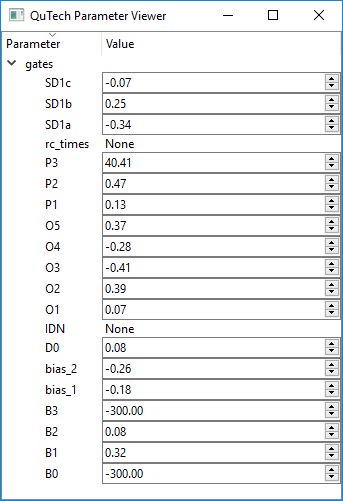
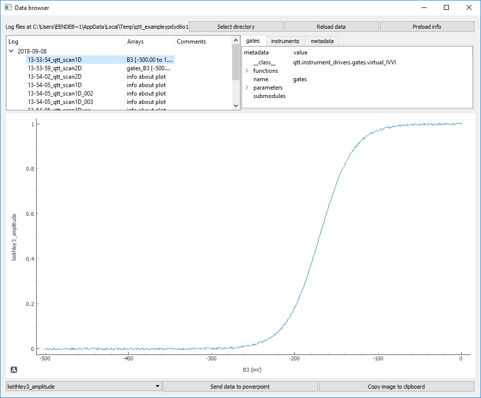
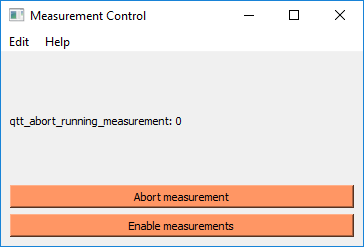

Measurements
============

To perform measurements several tools are available.

Scan functions
--------------

For basic scanning the following functions are available:

.. autosummary::

    qtt.measurements.scans.scan1D
    qtt.measurements.scans.scan2D
    qtt.measurements.scans.scan2Dfast
    qtt.measurements.scans.scan2Dturbo

For more advanced measurements, write your own data acquisition loop.

Parameter viewer
----------------

The ParameterViewer widget allow to view and set numeric parameters of instruments. To start the
ParameterViewer pass the instruments to be monitored as the first argument.

.. code-block:: python

    parameter_viewer = qtt.gui.parameterviewer.ParameterViewer([gates, keithley1], start_timer=True)
    parameter_viewer.setGeometry(100,100, 400, 800)

.. autosummary::
    qtt.gui.parameterviewer.ParameterViewer

    ParameterViewer widget
    
VideoMode
---------

The videmode tool can create fast charge stability diagrams using a 2D sawtooth wave.

.. autosummary::
    qtt.measurements.videomode.VideoMode

.. raw:: html

    <video width="800" height="600" style="width:90%; max-width:800px;" controls>
      <source src="_static/videomode-example.mp4" type="video/mp4">
      Your browser does not support the video tag.
    </video>
     

 

Data browser
------------

The data browser can be used to inspect recorded data. 

.. autosummary::
    qtt.gui.dataviewer.DataViewer
    

    DataViewer widget
        
Live plotting
-------------

Live plotting is done using a :code:`qcodes.QtPlot` window. The window can be setup with:

.. autosummary::
    qtt.utilties.tools.setupMeasurementWindows

Named gates
-----------

The :code:`virtual_IVVI` object can translate gate names into the proper channels of a DAC (or multiple DACs).

.. autosummary::
    qtt.instrument_drivers.gates.virtual_IVVI

Measurement control
-------------------

A simple GUI to abort running measurements without interfering with the instrument communication.

.. autosummary::
    qtt.live_plotting.MeasurementControl
   

    Measurement control widget
    
Virtual gates
-------------

.. autosummary::
    qtt.instrument_drivers.virtual_gates.virtual_gates

Storing the system state
------------------------

To store the system state one can store the ``station.snapshot()``. In order to restore the state,
it is often sufficient for spin-qubits to restore the DAC values.

.. autosummary::
    qtt.measurements.storage.save_state
    qtt.measurements.storage.load_state
    qtt.measurements.storage.list_states

For example:

.. code-block:: python
    
    import qtt.simulation.virtual_dot_array
    station = qtt.simulation.virtual_dot_array.initialize(reinit=True, nr_dots=2, maxelectrons=2, verbose=0)

    tag = save_state(station, virtual_gates = None)
    # do some work
    r = load_state(station=station, tag=tag, verbose=1)

Copying data to Powerpoint
--------------------------

To copy a dataset or a figure window to Powerpoint, including the scan metadata one can use:
 
.. autosummary::
 	qtt.utilties.tools.addPPT_dataset(dataset)
 	qtt.utilties.tools.addPPTslide(figure)

 	

